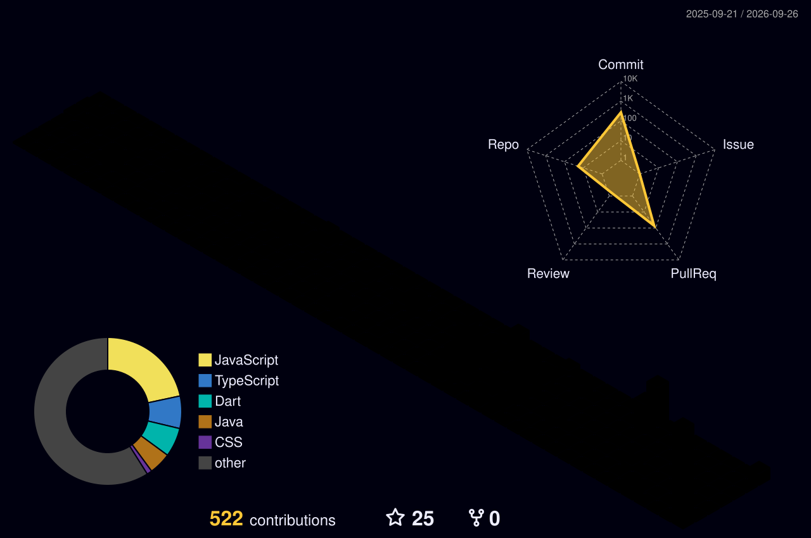

# Dang Khoa 👋

  
  
  

---

### About

- **Role:** Fullstack & Mobile Engineer
- **Languages:** Java, TypeScript, Dart, SQL
- **Frameworks:** Spring Boot, Next.js, React, Flutter
- **Practices:** Clean Architecture, Microservices, Domain-Driven Design
- **Focus:** Building high-performance backends and intuitive cross-platform applications

---

### Tech Stack

  <b>Languages & Frameworks</b> 
  

  <b>Databases, DevOps & Tools</b> 
  

---

### 3D Contribution Skyline

  

---

### GitHub Streak

  

---

### Contribution Snake

  <picture>
    <source media="(prefers-color-scheme: dark)" srcset="https://raw.githubusercontent.com/minKasent/minKasent/output/github-contribution-grid-snake-dark.svg">
    <source media="(prefers-color-scheme: light)" srcset="https://raw.githubusercontent.com/minKasent/minKasent/output/github-contribution-grid-snake.svg">
    
  </picture>

<!-- Pair Extraordinaire Trigger -->
